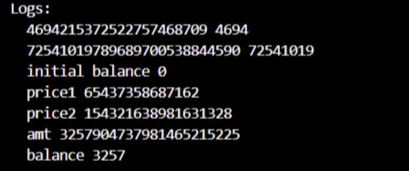

# Introduction
### Background
This post outlines the how Curve, I, and a few other white-hats saved ~$6m of LPs money through 2 rescues in the wake of the Vyper re-entrancy exploits. For those that are not aware, there was a compiler bug in a few old versions of Vyper which failed to utilize the same storage slot for re-entrancy locks with a common key. Many Curve pools were vulnerable. For more information, see the [Curve](https://hackmd.io/@vyperlang/HJUgNMhs2) and [Vyper](https://hackmd.io/@vyperlang/HJUgNMhs2) post-mortems.
### Story Summary
Soon after the ETH/CRV pool was exploited the first time, I quickly discovered and reported a critical insight to the Curve team that would allow someone to easily drain 3.5k ETH from the liquidity pool. The war room implemented my PoC into a flashloan, but unfortunately we were frontrun. (See Chainlight [post-mortem](https://medium.com/chainlight/curve-finance-analysis-and-post-mortem-ba55f2b26909) for more info).
There was still about $1m left in the pool after these two exploits, and through a complicated exploit we were able to white-hat the remainder. I worked on this for 6 days and the adrenaline rush was real. The open arms of the Curve community was unexpected and it was incredible to work with some of the top minds in the space. The entire experience was very unique, so I thought I would share it with the world - read the timeline below for a detailed story of what transpired!  
(Note: It is hard to precisely attribute credit with I/we, so the appendix includes full attribution)
# Let's `go()`
## July 30th - Day 1
**12:29 PST** I see [Spreekaway's](https://twitter.com/spreekaway/status/1685733468309725184?s=20) tweet sharing an exploit happened on ETH/CRV pool. I figured that the whole pool had been drained so I continue to scroll Twitter. 

**13:16 PST** I look at the ETH/CRV pool for the first time and I notice that there is still ~5k eth in the pool and a nominal amount of CRV. By AMM invariant logic, it would seem that you could sell a tiny amount of CRV for a huge chunk of the remaining ETH. I ask myself: "why hasn't this been done yet?"

To investigate, I start with `cast call exchange(1,0,10**18,0,false)` but it reverts. I open the pool code on Etherscan to read the `exchange()` function and I see that it uses internal accounting of balances rather than the actual balances. I figured that these might have diverged during the exploit. To confirm that this is the issue I check the `balances()` variable on Etherscan and see it return wildly incorrect values. *if i can update the internal balances, the pool becomes unbricked and thousands of ETH are easily drainable*. 

**13:41 PST** I `ctrl-f` the pool code for `self.balances` to see where they update, it appears the only way to update them is by calling `claim_admin_fees()`, which anyone can do. I create a Foundry project and a test. I try to `claim_admin_fees()`, but it reverts. Not a surprise, I know from making [stakedflip.fi]() fuzz tests that Curve pools tend to break at the extrema. I cheat some CRV, donate it to the pool, and `claim_admin_fees()` passes! I then add an exchange.

See the original test PoC here:
```solidity
function test() public { 
    console.log(pool.balances(0),pool.balances(0)/10**18);       
    console.log(pool.balances(1),pool.balances(1)/10**18); 
    
    pool.get_dy(1,0,10**12); 
    console.log("initial balance", owner.balance ); 
    console.log("price1",pool.get_dy(1,0,10**18)); 
    
    vm.prank(0x5f3b5DfEb7B28CDbD7FAba78963EE202a494e2A2); // crv whale
        crv.transfer(owner, 100 000*10**18);
    
    vm.prank(owner); 
        crv.transfer(address(pool),30000*10**18);
        
    pool.claim_admin_fees(); 
    console.log("price2", pool.get_dy(1,0,10**18)); 
    
    vm.startPrank(owner); crv.approve(address(pool),2**256 - 1); uint256 amt =     
        pool.exchange(1,0,70000*10**18,0,true); 
    console.log("amt",amt); 
    console.log("balance", owner.balance / 10**18); 
} 
```
<!--  -->

You can see that ETH balance of `owner` increased from 0 to 3.2k with 100k cheatcoded CRV:



**Boom**, for 100k CRV, one can drain 3.2k eth. I start to work on wrapping this into a flashloan so I have a more solid PoC to share. 

**14:01 PST** I decide that the Curve war room will act faster on this information. I post a tweet on Twitter since I wasn't able to reach them via their Telegram channel. This was my first foray into white-hatting, but I know that time is of the essence.
<blockquote class="twitter-tweet"><p lang="en" dir="ltr">Can someone from CRV team please contact me? can&#39;t reach you guys</p>&mdash; Addison (@0xaddi) <a href="https://twitter.com/0xaddi/status/1685758310673272832?ref_src=twsrc%5Etfw">July 30, 2023</a></blockquote> <script async src="https://platform.twitter.com/widgets.js" charset="utf-8"></script>

and share a hash in case something happens.

`sha256(you can drain the crv/eth pool right now by sending crv, claiming admin fees, and then selling crv into the pool for a thicc price. salt: 4G7P#QfC!YTsHYo4)`
<blockquote class="twitter-tweet"><p lang="pt" dir="ltr">70de231f22679e3c255be4f23908a797e9f7a92795a46e108e61eaeeb0a59b39</p>&mdash; Addison (@0xaddi) <a href="https://twitter.com/0xaddi/status/1685757408772046850?ref_src=twsrc%5Etfw">July 30, 2023</a></blockquote> <script async src="https://platform.twitter.com/widgets.js" charset="utf-8"></script>

**14:07 PST** Bout3Fiddy from the Curve team dms me in Telegram. I had seen him around but I was not sure what his role was on the Curve team so I ask him to tell Michael to dm me. I tell him that I have a PoC to drain several million USD and he tells Michael.

**14:16 PST** Michael reaches out to me and I share the exploit and the PoC
                
**14:22 PST** Michael confirms that its real and I ask him if I can join the war room so I can continue working on the PoC.

**14:27 PST** I'm invited to the war room and I give a recap of the exploit to the others:

> hi  
> summarizing what i found  
> 1) realized that the crv/eth pool was heavily imbalanced (almost no crv left).  
> 2) under amm logic that would mean I can swap a few CRV for hella eth  
> 3) that doesn't work because the pool balances are what they were prior to the flash loan attack  
> 4) the only way to update the pool balances is via `claim_admin_fees()`  
> 5) anyone can do `claim_admin_fees()`  
> 6) doing it right now fails, you have to donate like 30k crv for it to go through okay  
> 7) once it goes through you can swap for like 5k eth with 70k crv  

I continue to work on the flashloan. I postulate skipping the flashloan and just buying CRV for the rescue as it would be significantly faster. This was a simple exploit and was surprised nobody had acted yet - I wanted to move quickly. 

**14:52 PST** Bpak from Chainlight finishes the flashloan for the rescue that is able to retrieve ~3100 ETH, about an 85% recovery. There is some discussion about trying for more, but I propose that we take the 85% and try for the remainder after. 

**15:02 PST** I notice that Coffeebabe has exploited the pool (at the time we did not know that CB had frontrun Chainlight's leak). At this point I was disheartened because it was something that was so simple, and we were so close to saving it. 

**15:17 PST** I highlight that the remainder of the ETH/CRV pool can be recovered. I begin to start work on this. We realize that this is not going to be a simple exploit since `tweak_price` reverts in every function besides `remove_liquidity`.  Claiming admin fees no longer works. 

I'm not familiar with Curve v2 so the others begin work to determine the underlying issue. I tried to re-compile the pool contract with additional logging events to debug, but I ran into many issues when trying to `vm.etch` in Foundry. 

We realize that if we can get `tweak_price` to pass then we can recover the remaining funds. We try to figure out what the problem is.
## July 31 - Day 2
**13:38 PST** After his analysis, Robert Chen ([@notdeghost](twitter.com/notdeghost)) discovers that that virtual price needs to increase by 25x in order for tweak fees to pass. 

> an argument for why recovering funds from the crveth pool is impossible:
> 
> to pass `tweak_fees`, you need to increase the virtual price by a factor of 25x. virtual price can't be increased under normal operation because this would require an increase in actual value for other lp token holders.
> 
> I claim that (1) means you need to trigger reentrancy.
> 
> there are only three functions where you can trigger reentrancy. `remove_liquidity` is the only one that can be called without a guaranteed abort, because the other two call `tweak_price` with cached balances.^1
> 
> calling `remove_liquidity` first results in a higher CRV balance. the rest of the analysis still applies, and all other function calls must abort. 
> 
> ^1: this is workable if you can burn (100 - 1/25) = 96% of the balance during the reentrant call to decrease supply, but this seems unreasonable.


**15:10 PST** I decide that I should quit due to my minimal understanding of v2 maths (spoiler: I don't quit)
## August 1 - Day 3
**7:12 PST** Fiddy thinks the pool could be unbricked with another large donation

> but perhaps it can be done via: flashloan > donate > claim admin fees ---> manipulate vprice up ---> add liquidity is unborked > manipulate vprice down again > mint a lot of lp tokens > remove_liquidity > repay ?

**10:33 PST** I un-quit and try many permutations of donation amounts and discover that donating 7m CRV and 10k ETH along with a `claim_admin_fees` will unbrick the pool. This is less than we expected. 

Chen's previous insight was nearly spot on, but it missed that you can manipulate virtual price by donating to the pool. 

I setup the flashloan and work on replicating the original exploit now that we can get the pool into a drainable state. 

**21:04 PST** My rescue contract is able to donate 18m CRV and 3.4k ETH and drain the pool down to 7m crv and 1.8k ETH. We realize that draining the pool down to zero will not be trivial - it will require a narrow range of parameters that don't rebork the pool. 

```
// exploit pseudocode
crv.transfer(pool, donationAmount)
pool.claim_admin_fees()
repeat 10-50x:
	lpTokenAmt = pool.add_liquidity(lpAmounts)
	pool.remove_liquidity(lpTokenAmt) // triggers fallback and allows for re-entrancy
	// fallback
		pool.add_liquidity(lpAmounts)
		pool.exchange(0, 1, arbitraryNumber1) // purchase CRV 	  
	pool.remove_liquidity_one_coin(0) // remove all liquidity as eth
	pool.exchange(1,0, arbitraryNumber2) // purchase ETH
```

Sometimes `remove_liquidity` or `add_liquidity` will return `loss`, exchange will transfer way more than the pool actually has, or `tweak_price` will just fail. It's going to take a while for us to figure out how to manipulate `donationAmount`, `lpAmounts`, `arbitraryNumber1`, and `arbitraryNumber2` optimally. 

**23:02 PST** Chen iterates on our solution and gets it to drain the pool down to 356 eth and 48.8k crv
## August 2 - Day 4
**13:39 PST** I spend the day trying to gradient descent on the parameters to minimize USD value of the pool. Ultimately it is not possible because the surface is not continuous. Steps that might massively decrease `usd_val` might re-brick the pool. I hypothesize doing some sort of DFS.

**18:26 PST** Nagaking starts to modify [curve-sim](https://github.com/curveresearch/curvesim) to support re-entrancy to find the optimal exploit params. This involved adding a `fallback` parameter to the `remove_liquidity` that allowed you to perform operations prior to updating `D` after token transfer.

## August 3 - Day 5
**8:25 PST** We try skipping the re-enter `exchange` and instead just `add_liquidity`  inside the re-enter. This does not work.

**16:10 PST** Robert Chen gets the pool down to 70 eth and 24 crv, but with 100m+ gas. He explains that the exploit  `gives you a primitive to increase the pool's perceived CRV balance. thus, during the callback, you swap from ETH to CRV.` This `exploit technique gives you free CRV. you should get rid of as much CRV as possible at each step for ETH.`

Essentially, the re-enter `add_liquidity` + `exchange` would inflate the amount of CRV the pool thinks it has. Because of the AMM invariant, this devalues the CRV that the pool actually has.
## August 4 - Day 6
**7:01 PST** I tweak to a 2.7k CRV/ 376 ETH profit with a 135k flashloan fee and 40 eth left in the pool, and 16m gas. We decide we should try for a smaller flashloan fee.

**7:44 PST** I realize that the initial `add_liquidity` amount can be miniscule ( `< 10**10 wei`), which massively increases the efficiency of the loops. I ultimately realize that  re-entering mid `remove_liquidity` allows you to perform operations, but reset the pool balances to how they should be post `remove_liquidity`. Thus the liquidity amounts should be as small as possible: `lpAmounts ~= [0, 0]`.

I implement a loop of `get_dy` to dynamically calculate the amount of ETH and CRV to sell. Because the pool's internal balances are so inflated, `exchange` would begin to revert after a large number of loops because the pool would transfer out more tokens than it actually had. 

```
uint256 crvamt = crv.balanceOf(address(this)); // ideally we sell all the CRV we can
uint256 dy = 2**256 - 1; // start at the max for the loop
while (dy > address(pool).balance) { // once we receive a feasible amount, we proceed
	crvamt = crvamt * 9 / 10;

	// the pool is so borked that get_dy doesn't work for some amounts
	try pool.get_dy(1,0, crvamt) returns (uint256 _dy) {
		dy = _dy;
	} catch {
		crvamt = crvamt * 9 / 10;
	}
}

// the ETH amount is simpler
uint256 a = 250*10**18;

while (pool.get_dy(0,1,a) > crv.balanceOf(address(pool))) {
	a -= 1*10**18;
}
```

These were the two key insights that allow inflation of the pool internal balances to the maximum. After the loops finish, the pool thinks it has billions of crv, thus we can swap ~1.5 ETH for all the CRV left in the pool (~50m). 

I'm also able to reduce the flashloan fee to 45k CRV by changing the initial donation params to have more ETH. 

**12:55 PST**  I get the pool down to 37 ETH and zero CRV with a 45k crv flashloan fee and 27m gas. I tried many other parameter tweaks but was unable to get the ETH amount lower.  It requires more CRV to sell, which requires paying more in flashloan fees then possible ETH to recover.

**14:01 PST**  We get Scott Bigelow from Flashbots to help us submit the transaction. I combine the exploit into one contract and add a direct transfer to the contract controlled by `veCRV` holders. This way Curve DAO can transfer funds to an immutable distribution contract once the dusts settles. 

**16:17 PST** Scott begins to submit the payload via a modified version of [searcher-sponsored-tx](https://github.com/flashbots/searcher-sponsored-tx). When one submits a bundle, they specify the block number it should be included in. This repo resubmits the bundle for each block until it lands onchain. 

We nervously wait for 15 minutes for a validator to pick it up. We continue to wait because the transaction would fill an entire block, possibly messing with some validators configurations. 

Ultimately, the transaction does not land on chain. We determine that it is due to incorrect gas estimations in our simulations. 

**17:27 PST** I do another gas optimization and get it to easily fit within a block.

**18:44 PST** The pool state updates and I have to update the rescue params. It costs way too much gas to calculate the swap amounts on-chain, so the contract includes a flag on whether it should dynamically calculate or use swap values from calldata. 

**18:50 PST** I compile the new contract and send the bytecode over to Scott. He submits the bundle again, and within 30 seconds, the rescue lands on chain. I nervously opened Etherscan to see if it succeeded or if we got frontrun somehow. Luckily, we did not - we saved ~$700k!

<blockquote class="twitter-tweet"><p lang="en" dir="ltr">I along with <a href="https://twitter.com/NotDeGhost?ref_src=twsrc%5Etfw">@NotDeGhost</a>, <a href="https://twitter.com/CurveFinance?ref_src=twsrc%5Etfw">@CurveFinance</a> team and <a href="https://twitter.com/epheph?ref_src=twsrc%5Etfw">@epheph</a> have white-hatted ~$700k from the ETH/CRV pool (371 ETH and 92.5k CRV). Funds were sent atomically to the Aragon contract controlled by veCRV voters. They will be moved to a distribution contract for LPs to claim.…</p>&mdash; Addison (@0xaddi) <a href="https://twitter.com/0xaddi/status/1687641962940153857?ref_src=twsrc%5Etfw">August 5, 2023</a></blockquote> <script async src="https://platform.twitter.com/widgets.js" charset="utf-8"></script>

Txn: [0x006763dff653ecddfd3681181a29e7e6d6c2aaa7bafb27fe1376f3f7ce367c1e](https://etherscan.io/tx/0x006763dff653ecddfd3681181a29e7e6d6c2aaa7bafb27fe1376f3f7ce367c1e)
# Learnings
This was my first white-hat experience and I learned a huge amount through the process. There's a few things I'll do better next time. 
#### Flashloan Templates
I knew how flashloans worked but I hadn't implemented one before. It would have been super helpful if I had generalized flashloan templates with all the major providers (Uniswap, Balancer, Aave) and a registry of all the pool addresses on all chains. Finding all the interfaces and pool addresses, especially for aave v2 which was on an old compiler version took alot of time and this is something that could be easily prepared for ahead of time. If I had these templates prepared I could have made the original flashloan PoC in 10-20 minutes.
#### Private RPCs
As we saw with the several frontrunnings, these payloads must go through a private RPC. We spent some time looking for the best RPC and figuring out how to submit to it correctly. Scott from Flashbots ended up helping us submit the payload. He uses a modified version of [this](https://github.com/flashbots/searcher-sponsored-tx). I plan to test out this repo so that if the time comes again, we don't need to spend time figuring this out.
There's also a 2% chance that a block could be re-orged; this arises from validators proposing [blocks too late](https://www.samlewis.me/2022/03/beacon-chain-reorgs/#:~:text=You%20can%20see%20a%20list,frequently%20on%20Ethereum%20than%20Bitcoin.) or congestion in validator p2p. Block builders guarantee transaction privacy until block inclusion - once the block goes loose anything goes and transactions inside of a re-orged block could be repurposed. 
If for example this block was re-orged, Coffeebabe would have been able to simulate the exploit and frontrun it. If the exploit is several hundred million though, a malicious validator might try to reorg anyway. It could be worth setting up a service with trusted validators that allows sensitive payloads to land on-chain only if the validator set has several slots allocated in a row. Lido would be a good place for this.
### Confidentiality
I generally do not like to promote or share a ton of information; however, many people in the web3 security space do. In the short term it might be better to tweet alot about ongoing exploits to build Twitter clout, but in the longer run its more +ev to stay quiet since the people that actually matter will notice your good work. I did not realize the magnitude of importance of this, and its a consideration I had while even determining to write this post.
### Communication Clarity
Its really important that in these events that the communication is spot on. Nearly every piece of communication during this process was reviewed by multiple different parties. I did not do this for my tweet announcing the white-hat and there was some confusion. Napgener, although a fudster, and some others thought that this was a completely novel exploit but, in reality it was a variant of the original CRV/ETH exploit on the same pool.
<blockquote class="twitter-tweet"><p lang="en" dir="ltr">another crv/eth bug lol.<br>whitehat saved $700k this time.<br><br>sickening.<br>nobody will ever trust defi again<br><br>you got fools aping into <a href="https://twitter.com/search?q=%24CRV&amp;src=ctag&amp;ref_src=twsrc%5Etfw">$CRV</a> tokens at 40c in mid 8 fig size? <br>with critical vulnerabilities still live and team saying &quot;its all safu&quot;<a href="https://t.co/qvUf4GfBaI">https://t.co/qvUf4GfBaI</a> <a href="https://t.co/P9srmHEGTj">pic.twitter.com/P9srmHEGTj</a></p>&mdash; Napgenus ursus🧸🎯 (@napgener) <a href="https://twitter.com/napgener/status/1687646928081686528?ref_src=twsrc%5Etfw">August 5, 2023</a></blockquote> <script async src="https://platform.twitter.com/widgets.js" charset="utf-8"></script>

<blockquote class="twitter-tweet"><p lang="en" dir="ltr">Wait…. Are there still iffy contracts out there on Curve?</p>&mdash; DeFi Addiction (@DeFi_Addicti) <a href="https://twitter.com/DeFi_Addicti/status/1687648937652404224?ref_src=twsrc%5Etfw">August 5, 2023</a></blockquote> <script async src="https://platform.twitter.com/widgets.js" charset="utf-8"></script>

### Curve Math
Learned a lot about Curve math and increased my muscle of learning something complex quickly under time-pressure, and just trying to understand the essential components. 
# Credit Attribution
Please read below for explicit "who did what."
### White-hat #1
I found and shared the original PoC for the donation + `claim_admin_fees` + `exchange` that allows the majority of the pool to be drained
Chainlight wrapped the exploit into a flashloan, but inadvertenly leaked the exploit.
Coffeebabe frontran and returned the funds
### White-hat #2 
Group as a whole found that `tweak_price` was the issue
I said that if we got `tweak_price` to pass we could repeat the original exploit
Robert Chen determined that `virtual_price` needed to increase by ~25x for `tweak_price` to pass.
Bout3Fiddy said that we could do another donation + `claim_admin_fees` to increase the `virtual_price`
I found the donation params that worked and repeated the original exploit in flashloan
Robert Chen did a big optimization that made the exploit profitable and determined how the exploit worked
I determined the `add_liquidity` amount could be near zero, added the optimized `exchange` amounts, and reduced the gas usage
Scott Bigelow from Flashbots bundled the transaction and brought it to the chain privately via Flashbots relay